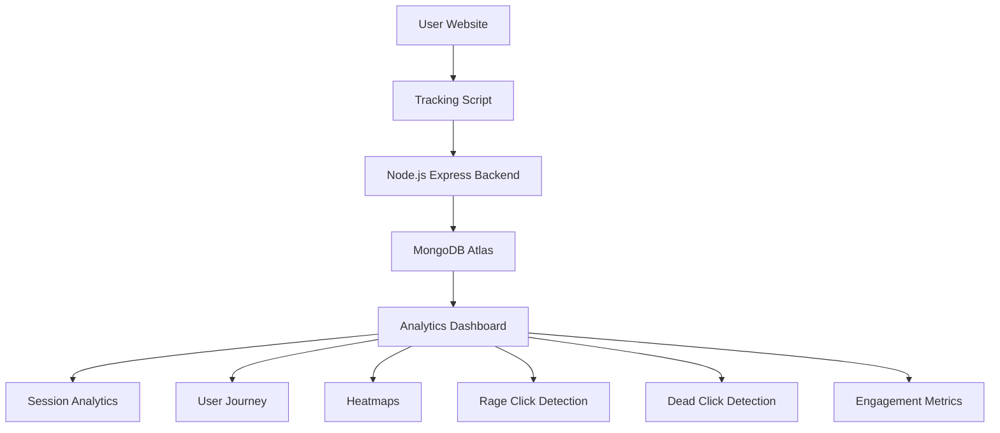

# CausalFunnel Analytics Platform

### Full-Stack User Analytics & Behavioral Insights Platform

A real-time analytics platform that captures user interactions, tracks user journeys, visualizes click heatmaps, and provides behavioral insights such as rage-click detection, dead-click analysis, and engagement scoring.

Built with **React.js, Node.js, Express.js, MongoDB Atlas, and Render**.

---

# Live Deployments

### Analytics Tracking Demo

https://causalfunnel-test-site.onrender.com/demo.html

### Analytics Dashboard

https://causalfunnel-dashboard.onrender.com/

---

# Project Overview

This application tracks user interactions on a webpage and provides actionable analytics through a centralized dashboard.

The system consists of:

* Client-side tracking script for collecting telemetry events
* Node.js backend for processing analytics data
* MongoDB Atlas for event persistence
* React dashboard for analytics visualization

The platform enables analysis of user journeys, interaction hotspots, engagement patterns, and user behavior insights.

---

# Key Achievements

* Real-time event tracking architecture
* Session-based user journey reconstruction
* Interactive click heatmap visualization
* Rage-click detection
* Dead-click detection
* Engagement scoring and analytics insights
* Export functionality (CSV / JSON)
* Fully deployed cloud-based solution using Render and MongoDB Atlas

---

# Assignment Requirements Coverage

The following requirements from the assignment have been implemented:

- Page View Tracking
- Click Tracking
- Session ID Management
- Event Storage in MongoDB
- Backend API Development
- Sessions View
- User Journey Visualization
- Heatmap Visualization
- Cloud Deployment

Additional features implemented beyond the assignment requirements:

- Rage Click Detection
- Dead Click Detection
- Engagement Scoring
- Hotspot Detection
- Session Search & Filtering
- Analytics Export (CSV / JSON)
- Behavioral Insights & Recommendations

---

# Architecture



### Architecture Overview

The tracking script captures user interactions such as page views, clicks, scrolls, rage clicks, and dead clicks.

Events are sent to a Node.js/Express backend and stored in MongoDB Atlas.

The React dashboard retrieves and aggregates this data to generate:

* Session Analytics
* User Journey Visualization
* Heatmaps
* Rage Click Detection
* Dead Click Detection
* Engagement Metrics

---

# System Design

## Overview

The application follows an event-driven analytics architecture.

A lightweight JavaScript tracking script is embedded into a webpage to capture user interactions. Events are transmitted to a backend API, stored in MongoDB Atlas, and later aggregated for visualization in the analytics dashboard.

---

## Event Flow

### 1. User Interaction

When a visitor interacts with the website, the tracking script captures:

* page_view
* click
* scroll
* rage_click
* dead_click

Example Event:

```json
{
  "sessionId": "abc123",
  "eventType": "click",
  "timestamp": "<ISO Timestamp>",
  "x": 250,
  "y": 180,
  "page": "/products"
}
```

---

### 2. Event Collection Layer

The tracking script listens for browser events and enriches them with metadata:

* Session ID
* Timestamp
* Current Page URL
* Click Coordinates
* Scroll Percentage
* User Activity Data

The event is sent asynchronously to the backend:

```http
POST /api/track
```

This ensures user interactions are recorded without affecting page performance.

---

### 3. Backend Processing

The Node.js + Express backend receives events and performs:

* Request Validation
* Event Formatting
* Session Grouping
* Data Persistence

Workflow:

```text
Tracking Script
      ↓
Express API
      ↓
Validate Event
      ↓
Store in MongoDB
```

---

### 4. Data Storage

MongoDB Atlas stores analytics data in an events collection.

Example Schema:

```javascript
{
  sessionId: String,
  eventType: String,
  timestamp: Date,
  page: String,
  x: Number,
  y: Number,
  scrollDepth: Number
}
```

Benefits:

* Flexible Schema
* Fast Event Ingestion
* Easy Aggregation Queries
* High Scalability

---

### 5. Analytics Engine

The dashboard aggregates stored events to generate insights.

#### Session Analytics

```text
Session A
 ├─ Page View
 ├─ Click
 ├─ Scroll
 └─ Rage Click
```

#### Heatmap Analytics

```text
(x,y) positions
      ↓
Frequency Count
      ↓
Heatmap Visualization
```

#### Rage Click Detection

Detected when:

```text
3+ clicks
within 1 second
within a small area
```

#### Dead Click Detection

Detected when:

```text
User Click
      ↓
No Navigation
No UI Change
within threshold
```

#### Engagement Metrics

Calculated using:

* Total Sessions
* Total Events
* Average Events Per Session
* Session Duration
* Rage Click Count
* Dead Click Count

---

# Request Flow

```text
User Action
    ↓
Tracker.js
    ↓
POST /api/track
    ↓
Express API
    ↓
MongoDB Atlas
    ↓
GET /api/sessions
GET /api/heatmap
    ↓
React Dashboard
```

---

# Dashboard Features

### Session Analytics

* Session Tracking
* Event Counts
* Session Duration
* User Activity Insights

### User Journey Visualization

* Chronological Event Timeline
* Session Reconstruction
* Navigation Analysis

### Heatmaps

* Click Distribution Visualization
* Interaction Hotspot Detection
* UX Optimization Insights

### Behavioral Analytics

* Rage Click Detection
* Dead Click Detection
* Engagement Scoring
* Automated Recommendations

---

# Technology Stack

## Frontend

* React.js
* JavaScript
* CSS3

## Event Tracking

* Vanilla JavaScript
* Browser LocalStorage

## Backend

* Node.js
* Express.js

## Database

* MongoDB Atlas
* Mongoose ODM

## Deployment

* Render

---

# Technology Choices

### React.js

Chosen for building a responsive and component-based analytics dashboard.

### Express.js

Provides lightweight and fast API development.

### MongoDB Atlas

Offers flexible schema design for analytics workloads and event storage.

### Render

Simplifies deployment and cloud hosting.

---

# Project Structure

```text
causalfunnel-analytics/

├── backend/
│   ├── controllers/
│   ├── models/
│   ├── routes/
│   ├── package.json
│   └── server.js
│
├── dashboard/
│   ├── src/
│   ├── public/
│   └── package.json
│
├── tracker/
│   ├── tracker.js
│   └── demo.html
│
├── .gitignore
└── README.md
```

---

# API Endpoints

| Method | Endpoint                     | Description            |
| ------ | ---------------------------- | ---------------------- |
| POST   | `/api/track`                 | Store analytics events |
| GET    | `/api/sessions`              | Fetch all sessions     |
| GET    | `/api/sessions/:sessionId`   | Fetch session events   |
| GET    | `/api/heatmap?pageUrl=<url>` | Heatmap data           |
| GET    | `/api/analytics`             | Dashboard analytics    |

---

## Screenshots

### Tracking Demo


### Session Analytics Dashboard


### User Journey Timeline


### Heatmap Visualization 1


### Heatmap Visualization 2


---

# Challenges Faced

### Session Identification

Maintaining unique sessions across page interactions using browser localStorage.

### Heatmap Data Collection

Capturing accurate click coordinates across different screen sizes.

### Rage Click Detection

Grouping repeated clicks occurring within a short time window and small screen area.

### Cloud Deployment

Managing frontend, backend, MongoDB Atlas, and Render integration.

---

# Local Setup

## Clone Repository

```bash
git clone https://github.com/sathish-00/CausalFunnel-Analytics.git
cd CausalFunnel-Analytics
```

## Backend Setup

```bash
cd backend
npm install
```

Create `.env`

```env
PORT=5000
MONGO_URI=your_mongodb_connection_string
```

Start Backend

```bash
npm run dev
```

## Dashboard Setup

```bash
cd dashboard
npm install
npm start
```

---

# Assumptions & Trade-offs

| Decision                | Benefit                      | Trade-off                     |
| ----------------------- | ---------------------------- | ----------------------------- |
| MongoDB                 | Flexible event storage       | Limited joins                 |
| Client-side tracking    | Easy integration             | Browser dependent             |
| REST APIs               | Simpler implementation       | More requests                 |
| Real-time event capture | Accurate analytics           | Higher storage usage          |
| Session-based analytics | Clear journey reconstruction | Session management complexity |

---

# Scalability Considerations

Future production enhancements:

* Kafka Event Streaming
* Redis Caching
* WebSocket Real-Time Dashboards
* Event Batching
* Data Aggregation Pipelines
* Horizontal Backend Scaling
* Session Replay
* Funnel Analytics

---

# Future Enhancements

* Session Replay
* Conversion Funnel Analytics
* User Authentication
* Device Analytics
* Browser Analytics
* Advanced Filtering
* Real-Time Monitoring

---


Recommended Demo Flow:

1. Open Demo Website
2. Generate Clicks and Scrolls
3. Open Dashboard
4. View Sessions
5. View User Journey
6. Open Heatmaps
7. Show Rage Click Detection
8. Show Dead Click Analysis

---

# Conclusion

This project demonstrates the complete lifecycle of a modern analytics platform including:

**Capture → Process → Store → Analyze → Visualize**

The solution successfully implements the assignment requirements while extending functionality with advanced behavioral analytics such as rage-click detection, dead-click analysis, engagement scoring, hotspot identification, and heatmap visualization.

---

# Author

**Sathish Kodari**

Developed as part of the CausalFunnel Full Stack Engineer Assignment.
